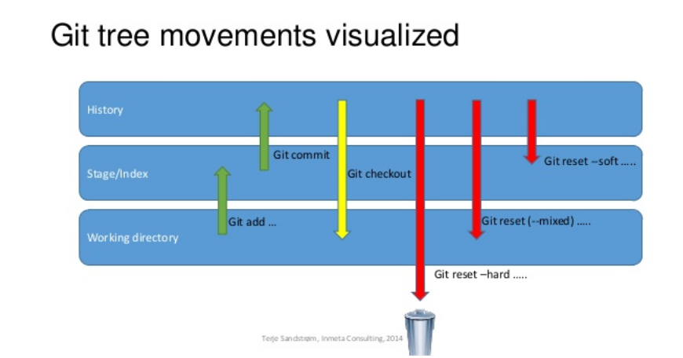

In this post I am going to swiftly share some useful git commands, which I think will make your life easier while working with git :)

---

## Modifying commits

**NOTE:** Any modification will result to a new commit being created, with a different hash, thus rewriting history. **Don't follow this practice for pushed commits**, unless you are sure that no one has pulled your changes.
<br/>

### Edit a commit's message or content

You just committed your changes and realized that you made a typo in the commit message. Run:

```shell
git commit --amend
```

Git will open your editor, where you can change the message on the first line. Save and exit. Git will **replace the old commit with a new one**, applying any changes you have made.

In case you want to **add more files to the commit**, the process is essentialy the same. However, you need to have staged the new files before, by running `git add .` or `git add <pathspec>`.
<br/>

### Split one commit into multiple

So you've made `commit A` with features `F1` and `F2`. And you realize that you might be better off having each feature represented in a different commit. You want to use **interactive rebase** for that.

- Start an interactive rebase session for the last commit:

```shell
git rebase -i HEAD~1
```

- On the editor window that will open, change the `pick` command to `edit`, save and close.

- Do a mixed reset to clear the index file of your changes and unstage the files:

```shell
git reset HEAD^
```

- At this point, you can stage and commit any files separately:

```shell
git add F1
git commit -m 'Feature 1'
git add F2
git commit -m 'Feature 2'
```

- Finally, run `git rebase --continue` to end the session.

Another alternative would be to stage files using `git add -p`, which lets you track individual changes in a file. This way you can create multiple commits off of one changed file, but this is beyond this article's scope. You can check [this post](https://www.codementor.io/@maksimivanov/add-specific-lines-with-git-patch-eais7k69j) for more information on how patch works.
<br/>

### Squash multiple commits into one

Oftentimes, you might end up with commits that are too "atomic" and maybe you want to meld them into one. Interactive rebase helps us with that, too. If we now want to squash the previously split commits `Feature 1` and `Feature 2`, we are gonna have to do the following:

```shell
git rebase -i HEAD~2
```

In the editor window you are going to see the commits listed in **reverse order** like this:

```shell
pick <hash> Feature 1
pick <hash> Feature 2
```

You now have two choices: You can either use `fixup` or `squash`.

- If you use `fixup` on `Feature 2` commit, its message will be discarded and it will be squashed into the previous `Feature 1`.

```shell
pick <hash> Feature 1
fixup <hash> Feature 2
```

- If you use `squash` on `Feature 2` commit, it will open a new editor window including both commits' messages, so you can decide what the final message will be.

```shell
pick <hash> Feature 1
squash <hash> Feature 2
```

<br/>

### Delete & reorder commits

Same as above, `git rebase -i` comes pretty handy when we want to delete or reorder commits, too. To delete, just change `pick` to `drop` on the commit you want to get rid of. To reorder, literally reorder the lines 😛

---

## Other useful commands

You can specify the commit when needed by either:

- Using a **commit-hash** (i.e. `83b99ab`).

Or:

- Using a `HEAD` offset (i.e. `HEAD~1` to indicate **1 commit before current `HEAD` location**).

**_Use these with caution, since uncommited changes in general can't be recovered from deletion._**

### Discard unstaged local changes

`git checkout .` will update your working-tree to match the git index file, effectively discarding any unstaged changes.
<br/>

### Discard ALL local changes

Everything is a mess and you decide to wipe every change you've made until now.

```shell
git reset --hard
```

This actually does three things:

- Moves the `HEAD` to `<commit>`.
- Resets the index file to match `<commit>`.
- Resets working directory to match `<commit>`.

So, it will **discard all changes**, staged or unstaged. You can specify a commit, if you also want to go back in time.
<br/>

### Go back to a previous commit (without affecting changes)

While working on a feature, you might want to rewind to a previous commit, without affecting uncommitted changes made in your working tree (i.e. when you want to create a new branch from an older commit and bring your current changes). A soft reset will only move the `HEAD`, leaving your working directory and index file untouched.

```shell
git reset <commit> --soft
```

<br/>

This image nicely explains visually how different `git reset` modes work.



---

Thank you for reading! 🤓
