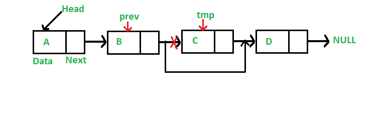

Today we are going to implement a (Singly) Linked List data structure in JavaScript 🥳

---

## What is a linked list?

In layman's terms, a linked list is a list of nodes, where each node holds two things:

- A value
- A pointer to the next node in the list.

The first node of the list is called **_'head'_**.
The last node of the list is called **_'tail'_**.

> Head and tail are not separate nodes. They are just references to the first and last node in the list, respectively.

 <br/>
  <br/>


 <br/>
  <br/>

> The last node of the list points to `null`. If the list is empty, then both **_head_** and **_tail_** point to `null`.

<br/>

## Creating a linked list in JavaScript

To define our linked list data structure, we are going to create a `class`. We initialize `head` and `tail` references as `null`. We also define some methods (`append`, `prepend`, `delete`, `getFirst`, `getLast` and `toArray`).

```js
class LinkedList {
  constructor() {
    this.head = null;
    this.tail = null;
  }

  append() {}

  prepend() {}

  delete() {}

  getFirst() {}

  getLast() {}

  toArray() {}
}
```

### Append

> Appends a node to the end of the list.

We create a new node object with 2 properties:

- A `value` property holding the provided value.
- A `next` property pointing to the next node, which in this case is `null`, since we append (it's the last node in the list).

We then check if there is a `tail` node and update it to point to the newly appended one. We implement an `if` check, because in case the list is empty (when appending the first node), then **`tail` is and should be `null`**, because there is no next node to point to.

After this, we **set the newly appended node as `tail`**.

Lastly, we check if `head` reference is `null`, which it is when first creating the list and **set the newly appended node as `head`**.

And there you have it, a method to append new nodes to our linked list data structure!

```js
append(value) {
    // New node object
    const newNode = {
        value,
        next: null
    };

    // Updating the previous tail node (last node) to point to the newly appended node
    if (this.tail) {
        this.tail.next = newNode;
    }

    // Setting the newly appended node as tail
    this.tail = newNode;

    // Setting the newly appended node as head, only if there is no head
    if (!this.head) {
        this.head = newNode;
    }
}
```

### Prepend

> Prepends a node to the beginning of the list.

This method, like the previous one, is going to accept the value to be prepended. The implementation is simple:

We create a new node object with the provided value, but instead of setting `next` property to `null` like in the `append` method, **we set it to point to the currently first node (`head`).**

Then, we **set the new node as `head`**, since it now sits at the beginning of our list and finally we check if tail is pointing to `null` as we did before, so that we **set it to point to the new node** (in case we use prepend to add a node to an empty list).

```js
prepend(value) {
    // New node object, with pointing to the current head
    const newNode = {
      value,
      next: this.head,
    };

    // Setting the newly prepended node as head
    this.head = newNode;

    // Setting the newly appended node as tail, only if there is no tail
    if (!this.tail) {
      this.tail = newNode;
    }
  }
```

Pretty straightforward, right? Let's now look at how we could implement a `delete` method.

### Delete

> Deletes all nodes with a certain value

This is going to be a tad more complex. But stay with me, once you own the core logic, you are going to achieve a deeper understanding on how linked lists work :)

The logic is the following:

- If there is no `head`, just return `null`, since the list is empty.
- Create a current node reference, initialized with the `head` node.
- Loop through all nodes in the list, find those that contain a certain value and **"delete" them, by pointing their previous node's index to their next node**, like this:

<br/>
<br/>



<br/>
<br/>

- At the end of each loop, increment current node reference, by setting it to the next one.
- Special handling for `head` and `tail` nodes deletion, as discussed below.

We are first going to handle two cases: Empty list and `head` deletion. We delete the `head` node, by simply setting the next node as `head`.

**NOTE:** A `while` loop is used, because we need to find and delete all elements containing a certain value, not just the first occurence. In case we delete the `head` and the new `head` also qualifies for deletion, we should also delete that too. The same of course applies for each consecutive node, so a `while` loop helps us with that.

```js
delete(value) {
    // If head is missing, the list is empty, therefore return null
    if (!this.head) {
      return null;
    }

    // Update head, by setting current head value to the next node
    while (this.head && this.head.value === value) {
      this.head.next;
    }
}
```

The core deletion logic is the following:

- **Loop through all nodes**, as long as their `next` property is not `null` (which is going to happend when we traverse the `tail`).
- If next node qualifies for deletion, **set current node to point to the node following the next node.**
- In any other case just increment the current node reference, **simply by reassigning it to the next node.**

```js
// Initializing currentNode reference as current head
let currentNode = this.head;

// Loop through every node that points to another one
while (currentNode.next) {
  // Checking whether next node's value qualifies for deletion
  if (currentNode.next.value === value) {
    // Set current node's next property to next node's next property,
    // effectively leaving no node pointing to the next node (node in the 'middle')
    currentNode.next = currentNode.next.next;
  }

  // If node doesn't qualify for deletion, set current node to the next one
  else {
    currentNode = currentNode.next;
  }
}
```

Finally handle `tail` node deletion like this:

```js
// Update tail, by setting current tail value to the last non-deleted node
if (this.tail.value === value) {
  this.tail = currentNode;
}
```

Our deletion code now should look like this:

```js
delete(value) {
    // If head is missing, the list is empty, therefore return null
    if (!this.head) {
      return null;
    }

    // Update head, by setting current head value to the next node
    while (this.head && this.head.value === value) {
      this.head.next;
    }

    // Initializing currentNode reference as current head
    let currentNode = this.head;

    // Loop through every node that points to another one
    while (currentNode.next) {
      // Checking whether next node's value qualifies for deletion
      if (currentNode.next.value === value) {
        // Set current node's next property to next node's next property,
        // effectively leaving no node pointing to the next node (node in the 'middle')
        currentNode.next = currentNode.next.next;
      }

      // If node doesn't qualify for deletion, set current node to the next one
      else {
        currentNode = currentNode.next;
      }
    }

    // Update tail, by setting current tail value to the last non-deleted node
    if (this.tail.value === value) {
      this.tail = currentNode;
    }
  }
```

### Getters

> Return current head or tail node

Those methods are trivial, just return current `head` and `tail`:

```js
getFirst() {
    return this.head;
  }

getLast() {
return this.tail;
}
```

### toArray

> Converts list to array

Finally, this method is going to convert our list to an `Array` for visualization purposes 😎

We are essentially going to push every node `Object` to an `Array` and return it. I hope that the code is self-explaining:

```js
toArray() {
    const elements = [];
    let currentNode = this.head;

    while (currentNode) {
      elements.push(currentNode);
      currentNode = currentNode.next;
    }

    return elements;
}
```

<br/>

## Final code

This is our final LinkedList `class`:

```js
class LinkedList {
  constructor() {
    this.head = null;
    this.tail = null;
  }

  append(value) {
    // New node object
    const newNode = {
      value,
      next: null
    };

    // Updating the previous tail node (last node) to point to the newly appended node
    if (this.tail) {
      this.tail.next = newNode;
    }

    // Setting the newly appended node as tail
    this.tail = newNode;

    // Setting the newly appended node as head, only if there is no head
    if (!this.head) {
      this.head = newNode;
    }
  }

  prepend(value) {
    // New node object, with pointing to the current head
    const newNode = {
      value,
      next: this.head
    };

    // Setting the newly prepended node as head
    this.head = newNode;

    // Setting the newly appended node as tail, only if there is no tail
    if (!this.tail) {
      this.tail = newNode;
    }
  }

  delete(value) {
    // If head is missing, the list is empty, therefore return null
    if (!this.head) {
      return null;
    }

    // Update head, by setting current head value to the next node
    while (this.head && this.head.value === value) {
      this.head.next;
    }

    // Initializing currentNode reference as current head
    let currentNode = this.head;

    // Loop through every node that points to another one
    while (currentNode.next) {
      // Checking whether next node's value qualifies for deletion
      if (currentNode.next.value === value) {
        // Set current node's next property to next node's next property,
        // effectively leaving no node pointing to the next node (node in the 'middle')
        currentNode.next = currentNode.next.next;
      }

      // If node doesn't qualify for deletion, set current node to the next one
      else {
        currentNode = currentNode.next;
      }
    }

    // Update tail, by setting current tail value to the last non-deleted node
    if (this.tail.value === value) {
      this.tail = currentNode;
    }
  }

  getFirst() {
    return this.head;
  }

  getLast() {
    return this.tail;
  }

  toArray() {
    const elements = [];
    let currentNode = this.head;

    while (currentNode) {
      elements.push(currentNode);
      currentNode = currentNode.next;
    }

    return elements;
  }
}
```

<br/>

## Linked List vs Array

### Pros

- When using a Linked List, there is no need to specify its length in advance, which is the case when dealing with Arrays. That happens, because Arrays need a continuous area of allocated memory, whereas Linked Lists don't suffer from that constraint, simply because they use pointers to defined their nodes.

**NOTE: However, JavaScript and most modern programming languages implement an abstract data type called 'Dynamic Arrays'.** These are essentially automatically resizable arrays, that allow us to effeciently use them while writing code at a higher level. Under the hood, the underlying JavaScript engine creates a "real" Array which is typically bigger in size and accommodates all our values. When it gets full, a new one is created and all the old elements are copied over it.

- Another use case where Linked Lists shine is when we often add new elements at the beginning or anywhere except for the end of it. When using Arrays, you have to shift all elements to the right, in order to prepend or instert a new one, thus wasting a lot of computing resources. When using a Linked List, you just need to change the previous node's pointer to point to the new node.

### Cons

- Accessing elements in a LL is of O(n) time complexity (linear), whereas accessing elements in an Array is of O(1) time complexity (constant), provided that we know the index of the element we are trying to access, of course. This happens because in a LL we have to traverse every node until we find the one we search for.

---

Thanks for reading, hope I was clear enough. Feel free to provide feedback in case I missed something! 😊
