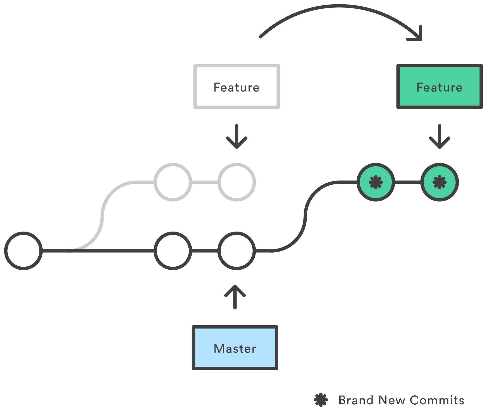

Here is another quick post about a neat thing I recently learned.

## Git pull

What `git pull` will actually do behind the scenes, is `git fetch & git merge`. It will fetch changes from the remote and create **a new _merge_ commit**.

## Git pull --rebase

What `git pull --rebase` will do, is `git fetch & git rebase`, effectively **reapplying our local changes on top of the remote changes**, resulting in a tidy, linear commit history, like this:



## Quick tips

**Tip #1:** Use `git config --global pull.rebase true` to avoid typing the `--rebase` flag each time you pull 🧐

**Tip #2:** Don't forget that you can do all sorts of editing to your commits, before pushing them by using **interactive rebase**.

```shell
git rebase -i
```

You can check more about this in my [other post](https://blog.manos-liakos.dev/git-commands/) about useful git commands.

**Warning: Use rebase only on local branches, as it rewrites commit history (creates new commits)!**
